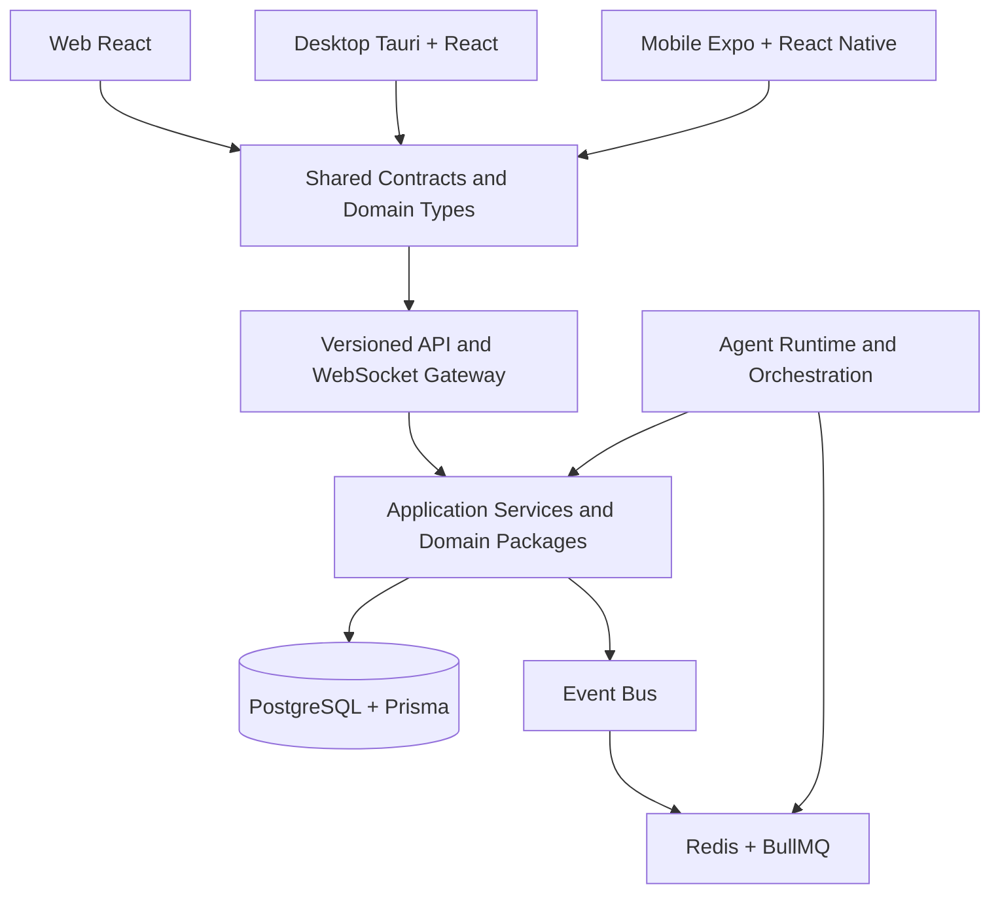

# CrewSpace Implementation Specification

**Status:** Approved for implementation planning
**Date:** 2026-09-21
**Product:** CrewSpace
**Source:** `ProductSummary.md`, `ProductDecisions.md`, and the accepted implementation-planning decisions

## 1. Purpose

CrewSpace is a cross-platform collaboration platform where humans and persistent AI teammates work inside shared Workspaces. It is one product delivered through Web, Desktop, and Mobile clients over a shared backend and source of truth.

This document turns the product direction into an executable phased implementation plan. It defines architecture, boundaries, dependencies, deliverables, tests, and exit criteria. Only Phase 1 is authorized for immediate implementation.

## 2. Non-Negotiable Rules

- The backend owns authentication, authorization, domain mutations, persistence, and synchronization state.
- Workspace membership and permissions are enforced server-side.
- Clients consume typed contracts and do not own business rules.
- Agents never receive unrestricted tools, data, or private knowledge.
- AI providers are accessed through runtime adapters, never directly from domain logic.
- Database entities are never exposed directly as API responses.
- Shared domain logic is not duplicated across Web, Desktop, and Mobile.
- Every autonomous or sensitive action is observable and auditable.
- Private Agent Knowledge never becomes shared knowledge implicitly.
- Each Phase must pass its exit gate before the next Phase begins.

## 3. Target System Architecture



### 3.1 Client architecture

- **Web:** React and TypeScript, responsive for desktop, tablet, and mobile web.
- **Desktop:** Tauri shell around the shared React client, with native notifications, deep links, and explicitly permitted filesystem access.
- **Mobile:** Expo and React Native with native navigation, push notifications, offline cache, reconnect handling, and approval workflows.
- **Shared:** API contracts, validation schemas, event types, domain state models, permissions vocabulary, design tokens, and platform-neutral client services.
- **Platform-specific:** Native capabilities and presentation patterns only where the platform requires them.

### 3.2 Backend architecture

- **API app:** NestJS modules, versioned REST controllers, WebSocket gateway, authentication boundary, DTO validation, and error mapping.
- **Domain packages:** Agents, Workspaces, Permissions, Conversations, Memory, Relationships, Projects, Tasks, Decisions, Convene, Tools, Notifications, and Integrations.
- **Repositories:** Persistence abstractions that prevent application services from depending directly on Prisma models.
- **Worker app:** BullMQ consumers for agent executions, scheduled initiative, notifications, indexing, and integrations.
- **Database:** PostgreSQL with Prisma migrations, UUID identifiers, timestamps, foreign keys, indexes, uniqueness constraints, and explicit cascade policies.
- **Event bus:** In-memory implementation first, with an interface suitable for Redis-backed distribution.

## 4. Monorepo Specification

```text
apps/
  api/              NestJS HTTP and WebSocket API
  desktop/          Tauri shell and desktop client
  mobile/           Expo React Native client
  web/              React web client
  worker/           Background jobs and scheduled work
packages/
  core/             Domain primitives and shared utilities
  database/         Prisma schema, migrations, repositories
  agents/           Agent identity, personas, capabilities
  orchestration/    Runtime, execution, scheduling, Convene
  memory/           Memory extraction, retrieval, ranking, scopes
  relationships/    Collaboration Context
  knowledge/        KnowledgeProvider abstraction and indexing
  conversations/    Conversation and message domain
  tasks/            Tasks and dependencies
  decisions/        Durable decisions
  tools/            ToolRegistry and tool adapters
  permissions/      Authorization and capability checks
  events/           Domain event types and EventBus
  search/           SearchProvider abstraction
  notifications/    Notification domain and delivery
  integrations/     External integration adapters
  contracts/        DTOs, schemas, API and WebSocket contracts
  ui/               Shared design tokens and portable primitives
  config/           Typed configuration and environment handling
  platform/         Cross-platform capability abstractions
docs/               Architecture, ADRs, operations, and feature docs
infra/              Docker Compose and deployment assets
tests/              Cross-package and end-to-end scenarios
```

Package dependencies must point inward toward domain abstractions. Client applications may depend on contracts, UI, platform abstractions, and state adapters, but not on database or provider implementations.

## 5. Domain Boundaries

| Boundary | Owns | Must not own |
|---|---|---|
| Identity | Users, sessions, authentication providers | Workspace roles |
| Workspace | Workspaces, membership, invitations, tenant scope | Agent reasoning |
| Permissions | Roles, capabilities, authorization decisions | UI-only visibility |
| Agents | Persistent Agent identity, Persona, status, capabilities | Provider-specific API calls |
| Memory | Scoped memory lifecycle and retrieval | Arbitrary conversation archiving |
| Relationships | Collaboration Context and interaction history | Literal emotional state |
| Conversations | Participants, messages, conversation types | Model execution policy |
| Orchestration | Agent execution, scheduling, Convene | Client rendering |
| Knowledge | Shared/project knowledge and provider abstraction | Private access bypasses |
| Tasks | Work items, dependencies, status transitions | Agent autonomy decisions |
| Decisions | Durable conclusions and provenance | Unstructured chat transcripts |
| Tools | Tool registration, permissions, execution metadata | Implicit capabilities |
| Events | Typed domain events and delivery abstraction | Undeclared side effects |
| Notifications | User-facing notification policy and delivery state | Domain authorization |

## 6. Core Domain Model

### 6.1 Identity and tenancy

- `User` is global.
- `Workspace` is the tenant boundary.
- `WorkspaceMember` links a User to a Workspace and owns the role.
- `WorkspaceInvitation` is scoped to a Workspace, expires or is revoked, and requires authentication before acceptance.
- All tenant-owned aggregates carry an owning Workspace or an unambiguous parent that carries one.

### 6.2 Agent model

An Agent is a persistent Workspace-owned teammate with:

- Name, avatar, role, and status.
- Persona reference.
- Model configuration reference.
- Explicit permissions and capabilities.
- Private workspace reference.
- Execution and activity history.

Agent status transitions are controlled by the backend and emitted as events. Clients display status but cannot set arbitrary status values.

### 6.3 Knowledge and privacy

Every knowledge item has an explicit scope:

- Private Agent Knowledge.
- Shared Workspace Knowledge.
- Project Knowledge.
- Public Conversation.

Context construction must check scope before retrieval. Search providers must receive an authorization-scoped query context rather than a raw user query alone.

### 6.4 Work and collaboration

Projects group humans, Agents, Tasks, Documents, Decisions, Conversations, and Files. Tasks are actionable work with status, priority, owner, provenance, and dependencies. Decisions are durable knowledge with context, alternatives, participants, source conversation, and timestamp.

A Convene is a structured multi-participant collaboration session. A Whisper Room is a private Agent-to-Agent Conversation with explicit observation and participation permissions.

## 7. Persistence Specification

The initial Prisma model will cover these groups:

- Identity: `User`, authentication identities, sessions.
- Workspace: `Workspace`, `WorkspaceMember`, `WorkspaceInvitation`.
- Agents: `Agent`, `AgentPersona`, `AgentMemory`, `AgentPrivateFile`, `AgentPrivateNote`, `AgentRelationship`.
- Work: `Project`, `ProjectMember`, `Task`, `TaskDependency`, `Decision`.
- Communication: `Channel`, `Conversation`, `ConversationMember`, `Message`.
- Orchestration: `Convene`, `ConveneParticipant`, `AgentExecution`, `AgentEvent`.
- Tools and files: `Tool`, `AgentToolPermission`, `Document`, `File`.
- Operations: `Notification`, `NotificationPreference`, `Integration`, `IntegrationCredential`, `UsageRecord`, `AuditLog`.

Persistence requirements:

- UUID primary keys and UTC timestamps.
- Foreign keys for all ownership and membership relationships.
- Composite uniqueness for membership and participant joins.
- Indexes on tenant scope, status, timestamps, and lookup keys.
- Explicit delete behavior for private data, memberships, invitations, and dependent records.
- Repository methods require an authorization-scoped context.
- API DTOs are separate from Prisma entities.

## 8. API and Event Contracts

REST endpoints are versioned under `/api/v1/`. Every endpoint defines request DTOs, validation, authorization requirements, response contracts, and domain error mappings.

Initial foundation endpoints:

- `POST /api/v1/auth/register`
- `POST /api/v1/auth/login`
- `POST /api/v1/auth/logout`
- `GET /api/v1/auth/session`
- `GET /api/v1/workspaces`
- `POST /api/v1/workspaces`
- `GET /api/v1/workspaces/:workspaceId`
- `GET /api/v1/workspaces/:workspaceId/members`
- `GET /api/v1/health`

Planned event families include `WorkspaceCreated`, `MemberInvited`, `AgentCreated`, `AgentStatusChanged`, `MessageCreated`, `TaskUpdated`, `DecisionCreated`, `ConveneStarted`, `ConveneCompleted`, `FileUploaded`, and `NotificationCreated`.

Each event carries an event identifier, type, aggregate identifier, Workspace scope, sequence or ordering metadata, actor, timestamp, and version. Clients must treat event identifiers as idempotency keys.

## 9. Security and Authorization

- Authenticate every protected request.
- Resolve Workspace membership server-side for every tenant operation.
- Centralize authorization policy and capability checks.
- Use least privilege for Agents, tools, integrations, private knowledge, and files.
- Hash passwords with a current password hashing algorithm.
- Store sessions or tokens securely and rotate/revoke them appropriately.
- Encrypt integration credentials at rest.
- Validate inputs and sanitize outputs crossing trust boundaries.
- Rate-limit authentication, invitations, and expensive operations.
- Add SSRF protections before URL fetching exists.
- Audit membership, permission, private-access, tool, approval, integration, and destructive actions.

## 10. Testing Strategy

### Baseline for every Phase

- Unit tests for changed domain behavior.
- Integration tests for changed persistence or API behavior.
- Lint.
- Typecheck.
- Build.
- Migration validation when the schema changes.

### Phase-specific expansion

- WebSocket contract and reconnect tests when real-time features begin.
- Platform smoke tests for Web, Desktop, and Mobile shell behavior.
- Cross-platform E2E for message propagation and mobile approval.
- MockAgentRuntime for all normal CI agent tests.
- No real AI provider credentials in normal CI.

The complete lifecycle E2E will cover workspace creation, invitation, Agent creation, Project creation, conversation, Agent execution, Memory update, Collaboration Context update, Agent-to-Agent communication, Whisper Room, Convene, Decision, Task, review, and completion.

## 11. Phase Roadmap

A Phase is an independently verifiable delivery increment with defined scope, dependencies, tests, and an exit gate. The roadmap is documented in full, but only Phase 1 is currently authorized for implementation.

### Phase 1: Foundation

**Goal:** Establish the monorepo, shared boundaries, authentication, tenancy, RBAC, persistence, and authenticated client shells.

**Deliverables:**

- pnpm workspace and Turborepo configuration.
- Shared `core`, `contracts`, `config`, `platform`, and `ui` foundations.
- NestJS API and worker bootstraps.
- PostgreSQL and Redis Docker Compose services.
- Prisma schema and first migration for User, Workspace, WorkspaceMember, and sessions.
- Email/password authentication end to end.
- OAuth provider interfaces and mocked Google/GitHub adapters.
- Workspace creation, selection, and membership APIs.
- Server-enforced OWNER, ADMIN, MEMBER, and GUEST roles.
- Web, Desktop, and Mobile authenticated shells.
- Role-aware navigation and explicit placeholders for future features.
- Health checks, structured configuration, logging baseline, and CI commands.
- Architecture, security, development, and API documentation updates.

**Acceptance criteria:**

- A User can register, sign in, sign out, and retrieve the current session.
- A User can create and select a Workspace.
- A User can belong to multiple Workspaces.
- Unauthorized Users cannot read or mutate another Workspace.
- Role checks are enforced by backend tests, not only client presentation.
- All three clients authenticate against the same API.
- Shared contracts compile for all clients.
- PostgreSQL migrations run from a clean database.
- Tests, lint, typecheck, and builds pass.

**Exit gate:** Phase 1 is stable only after the acceptance criteria and baseline quality checks pass in CI and locally with Docker Compose.

### Phase 2: Workspace Collaboration

**Goal:** Complete Workspace membership and invitations.

**Deliverables:** Email invitations, shareable links, expiration, revocation, usage limits, role restrictions, optional password, acceptance flow, audit logging, workspace settings, and member management.

**Exit gate:** Invitation lifecycle tests pass for pending, accepted, expired, and revoked states, including tenant and role enforcement.

### Phase 3: Agents and Personas

**Goal:** Introduce persistent AI teammates.

**Deliverables:** Agent CRUD, Persona CRUD, starter team templates for Atlas, Iris, Bram, and Nova, status model, capabilities, model configuration, permissions, profile, and activity contracts.

**Exit gate:** Agents are workspace-scoped, customizable, permission-scoped, and visible consistently in all clients.

### Phase 4: Private Agent Workspace and Memory

**Goal:** Add private Agent knowledge without accidental disclosure.

**Deliverables:** Private notes, files, observations, memory types, scoped retrieval, inspection permissions, versioning where needed, extraction boundaries, and access tests.

**Exit gate:** Cross-Agent, cross-Workspace, and ordinary-search privacy tests pass.

### Phase 5: Conversations and Chat

**Goal:** Enable human-Agent, human-human, group, channel, and Agent DM communication.

**Deliverables:** Conversation types, membership, messages, pagination, drafts, message events, read state, mentions, attachments, and chat UI across clients.

**Exit gate:** A message created on Web is received and rendered on Desktop and Mobile through the backend event path.

### Phase 6: Agent Runtime

**Goal:** Add provider-independent Agent execution.

**Deliverables:** `AgentRuntime` interface, MockRuntime, provider adapters, ContextBuilder, execution loop, streaming, cancellation, retry, timeout, failure recovery, usage records, and execution events.

**Exit gate:** Mock runtime completes, cancels, retries, times out, and records auditable execution state without provider calls in domain code.

### Phase 7: Agent-to-Agent Communication

**Goal:** Enable controlled Agent collaboration.

**Deliverables:** Agent DM, message and token limits, cooldowns, relevance checks, maximum depth, execution budgets, loop detection, and activity visibility.

**Exit gate:** Loop and budget tests demonstrate bounded execution and clear failure states.

### Phase 8: Collaboration Context

**Goal:** Store inspectable collaboration patterns.

**Deliverables:** Relationship records, interaction counts, communication preferences, recent interactions, unresolved topics, summaries, editing, audit history, and permission scope.

**Exit gate:** Collaboration Context is editable, auditable, permission-scoped, and never represented as literal emotion.

### Phase 9: Agent Initiative

**Goal:** Allow useful, bounded proactive work.

**Deliverables:** AgentScheduler, cadence configuration, time zones, active hours, wake cycle, reasons for action, cooldowns, budgets, and `NO_ACTION` behavior.

**Exit gate:** Scheduled work respects cadence, active hours, budgets, permissions, cancellation, and audit requirements.

### Phase 10: Projects, Tasks, and Decisions

**Goal:** Connect collaboration to durable execution.

**Deliverables:** Projects, members, Tasks, dependencies, status transitions, priorities, assignments, documents, Decisions, provenance, searchability, and task review.

**Exit gate:** A Decision can create or relate to Tasks, and authorized Agents can retrieve relevant prior Decisions.

### Phase 11: Convene

**Goal:** Orchestrate structured multi-perspective decisions.

**Deliverables:** Convene lifecycle, participant selection, discussion, evidence, synthesis, decision, alternatives, action items, owners, pause/resume, and UI.

**Exit gate:** A Convene can complete from creation through Decision and generated Tasks with all transitions and permissions audited.

### Phase 12: Human Approval and Advanced Permissions

**Goal:** Put explicit human control around sensitive actions.

**Deliverables:** Approval requests, approve/reject transitions, capability policies, tool permissions, destructive-action safeguards, audit records, and mobile approval UI.

**Exit gate:** An approval initiated by an Agent can be approved on Mobile and reflected on Web and Desktop through the event system.

### Phase 13: Realtime, Offline, and Full Client Delivery

**Goal:** Harden cross-platform synchronization and client parity.

**Deliverables:** Ordered WebSocket events, reconnect, missed-event recovery, duplicate handling, optimistic reconciliation, conflict resolution, cached data, offline indicators, retry queues, push notifications, system notifications, deep links, and native platform behaviors.

**Exit gate:** Cross-platform E2E covers message propagation, mobile approval, reconnect, offline mode, stale clients, duplicate events, authentication expiry, notification delivery, permission changes, and workspace switching.

### Phase 14: Integrations

**Goal:** Add controlled external systems.

**Deliverables:** GitHub, GitLab, Linear, Jira, Slack, Google Drive, Notion, Calendar, and MCP adapters; encrypted credentials; revocation; least privilege; audit logs; rate limits; and integration-specific tests.

**Exit gate:** Each integration has an adapter contract, permission tests, credential lifecycle, failure handling, and audit coverage.

### Phase 15: Advanced Intelligence

**Goal:** Improve relevance, autonomy, search, and operational insight without weakening control.

**Deliverables:** Embeddings and hybrid search providers, advanced memory ranking, richer planning, cost controls, observability dashboards, provider expansion, and orchestration strategies.

**Exit gate:** New providers and strategies can be added through abstractions without changing core domain rules, and usage, cost, privacy, and audit tests remain green.

## 12. Phase 1 Work Breakdown

Implementation order within Phase 1:

1. Repository and package manifests.
2. Shared configuration, errors, identifiers, and contracts.
3. Prisma schema, database package, migrations, and repositories.
4. Authentication domain and provider ports.
5. Workspace and membership domain services.
6. Permission policies and request authorization context.
7. NestJS API modules and versioned DTOs.
8. WebSocket gateway foundation and typed event envelope.
9. Web, Desktop, and Mobile shell applications.
10. Docker Compose, CI commands, logging, health checks, and documentation.
11. Unit, integration, API, and client smoke tests.
12. Full Phase 1 validation and generated-diff review.

## 13. Required Documentation

The implementation must maintain:

- `README.md` for product purpose and contributor entry point.
- `CONTRIBUTING.md` for local development and contribution workflow.
- `SECURITY.md` for threat model, reporting, and security boundaries.
- `ProductDecisions.md` for accepted product and architecture decisions.
- `CONTEXT.md` for canonical domain vocabulary.
- `docs/architecture.md` for system boundaries.
- `docs/cross-platform.md` for shared client behavior.
- `docs/api.md` for public API contracts.
- `docs/development.md` for setup, commands, migrations, tests, and local infrastructure.
- Dedicated feature documents as each later Phase begins.

## 14. Definition of Done

A Phase is complete only when:

- Its acceptance criteria are demonstrated by tests or documented verification.
- Its domain rules live in the owning domain/application boundary.
- Authorization and tenant isolation are tested.
- Public contracts and error behavior are documented.
- Migrations are reproducible where applicable.
- Tests, lint, typecheck, and build pass.
- Operational concerns introduced by the Phase are observable.
- Documentation and the domain glossary are updated.
- The working diff has been inspected.
- No later Phase capability has been smuggled into the implementation.
